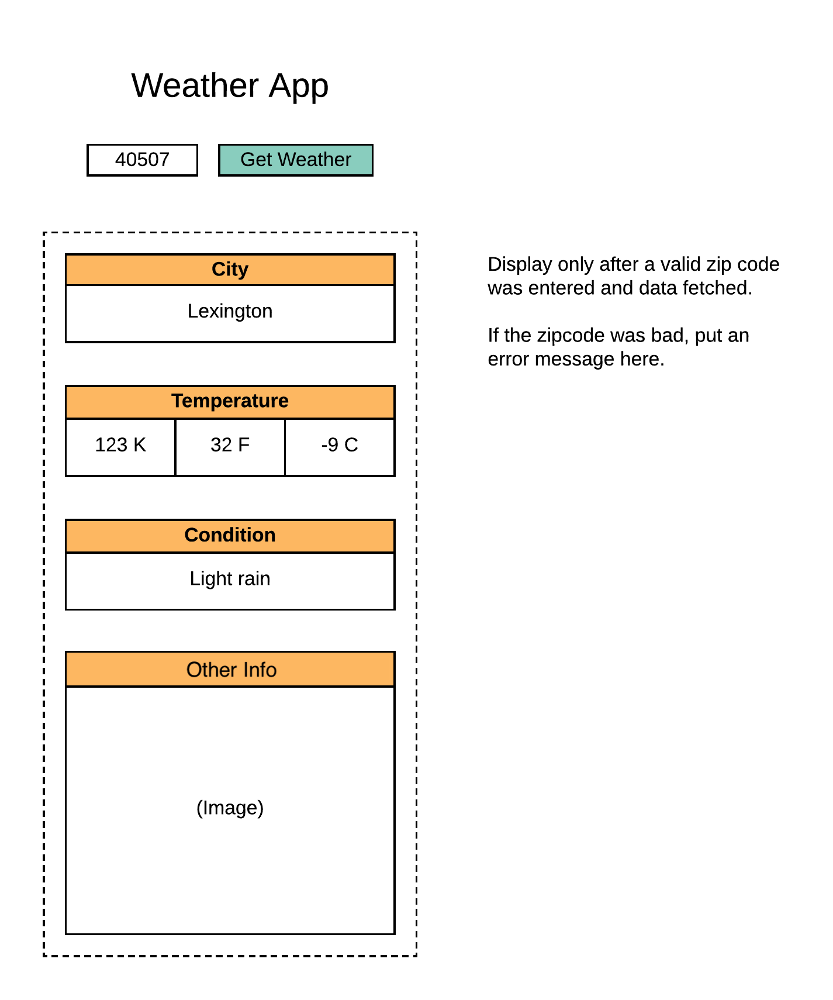

zip code input
city
Current weather
temp
image

single div
- dynamic generation with javascript

handle unsuccessful events

bootstrap
- dynamic break points
- mobile first

api end point?
zip code validation
---
## Methods
      let ul = getElementById
      let li1 = createelement('li')
      li1.textContent
      ul.appendChild(li1)

      function createListItem(parentEl, tag, textContent){
      Default text --- function createListItem(parentEl, tag, text = 'didn't include this'){
      if(!text){

      }
         let list = document.createelement(tag)
         list.textcontent = text
         if(id) {
            element.id = id
         }
         parentEl.appendChild(list)
      }

      init(){
         createListItem(ul, 'li', 'list Item 1')
         createListItem(ul, 'li', 'list Item 2')
         createListItem(ul, 'li', 'list Item 3')
         createListItem(main, 'div', 'list Item 1')
      }

---

Find api data structure
icon: ...
Description: ...
name: ...
temp: ...

    var code = apiCode
    global so that it can be easily updated

    state = [
      data()
      object values from data funct
    {
       icon: ...
       Description: ...
       name: ...
       temp: ...
    },
    {
    icon: ...
       Description: ...
       name: ...
       temp: ...
    }
    ];
    
    getWeather() {
    gets data from api
       fetch('url + ${userInputZip} + apiCode or code')
       fetch returns values
       set interval for live update
       time()
    };

    time() {
      new Date()
      last updated time
      getting updated time on set interval of getWeather()
    }

    initialState() {
       getElementById
       create elements
       - user input & submit btn
       - header
       append elements
       assign container class - classlist
       gets values from getWeather()
    };
    
    data() {
      getWeather()
       async
       displays values only when valid zip is entered
       throws error message if zip is invalid 
       - city
       - temp - convert value
       - condition
       - images?
    }
    
    tempConvert(temp) {
      converts temp values if needed
      k - 273.15 = temp;
      return temp;
    };
    
    image() {
       picks images from an array[] of images
       based on weather conditions
    };
    
    buttonCLick() {
      getWeather()
      call axios on button click

       check if valid zip
       
       if (invalid) {
       return error('invalid zip')
       };
    };
    
    clearData() {
    
    };
    
